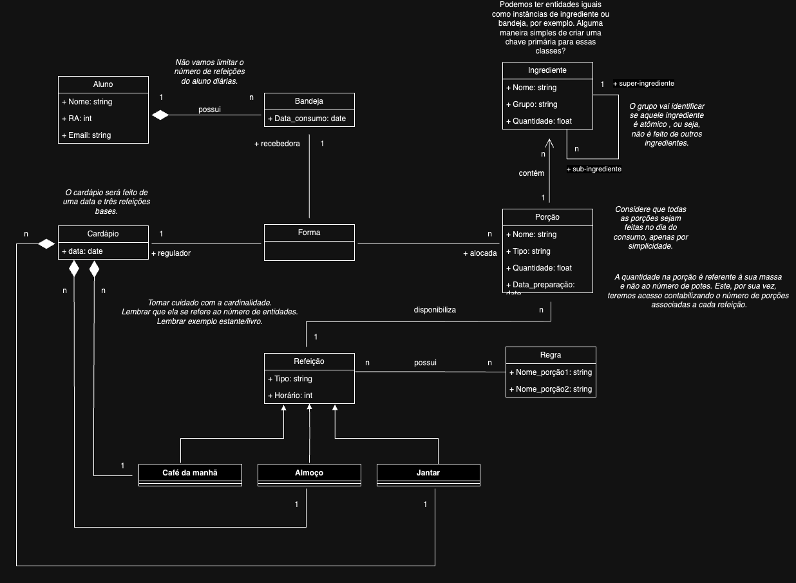

# Equipe Data Miners

# Subgrupo B
* Caio Melloni dos Santos - 167974
* Udson Charles Batagini - 244899
* Guilherme Segolin Selmi - 173947

## Modelo Conceitual ER Revisado

*Diagrama ER Revisado*

## Mapeamento para o Modelo Relacional
~~~
ALUNO(Nome, _RA_ , Email)

BANDEJA(_Id_, Data_consumo, RA_aluno)
   RA_aluno chave estrangeira -> ALUNO(Ra)

FORMA(_Id_, Id_bandeja, Id_cardápio) - falta a chave primária
   Id_bandeja chave estrangeira -> BANDEJA(Id)
   Id_cardápio chave estrangeira -> CARDÁPIO(Id)

FORMA_PORÇÃO(_Id_, Id_forma, Id_porção)
   Id_forma chave estrangeira -> FORMA(Id)
   Id_porção chave estrangeira -> PORÇÃO(Nome)

CARDÁPIO(_Id_, Data, Tipo_refeicao, Id_refeição)
   Id_refeição chave estrangeira -> REFEIÇÃO(ID)

REFEIÇÃO(_Id_, Tipo, Horário)

REGRA_REFEIÇÃO(_Id_, Id_refeição, Id_regra)
  Id_refeição chave estrangeira -> REFEIÇÃO(Id)
  Id_regra chave estrangeira -> REGRA(Id) 

REGRA(_Id_, Nome_porção1, Nome_porção2)

PORÇÃO(_Nome_, Tipo, Quantidade, Data_preparação, Id_refeição)
  Id_refeição chave estrangeira -> REFEIÇÃO(Id) 

INGREDIENTE(Id_ingrediente, Nome, Grupo, Quantidade, Ref_ingrediente, Nome_porção)
   Ref_ingrediente chave estrangeira -> INGREDIENTE(Id_ingrediente)
   Nome_porção chave estrangeira -> PORÇÃO(Nome)
~~~
