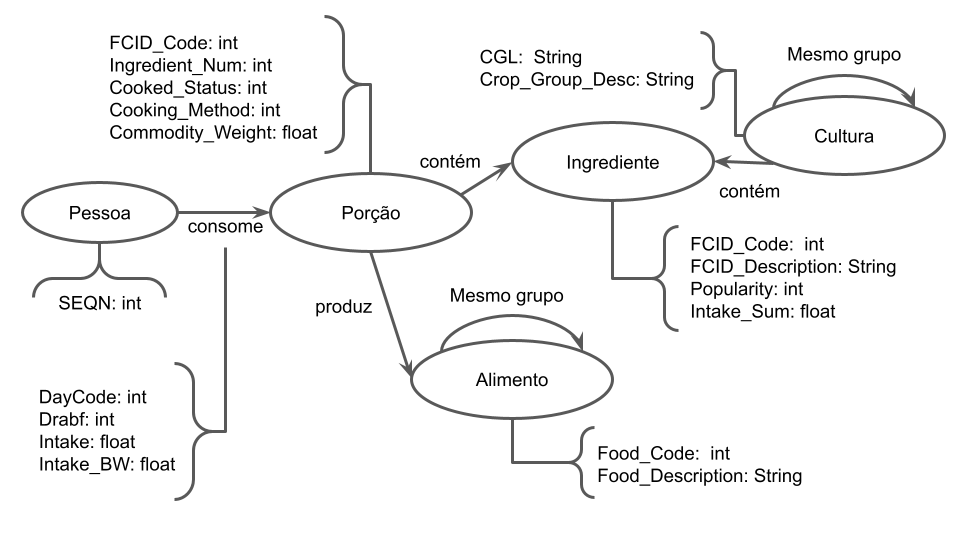

# Equipe Data Miners

# Subgrupo B
* Caio Melloni dos Santos - 167974
* Udson Charles Batagini - 244899
* Guilherme Segolin Selmi - 173947

## Modelo Lógico do Banco de Dados de Grafos

> 

## Perguntas de Pesquisa/Análise

> Liste aqui as três perguntas de pesquisa/análise
> * Quais são os alimentos possíveis que contenham cenoura e beterraba?
> * No dia X, qual o ponto de cozimento da carne Y que foi mais consumido?
> * Quantos ingredientes brutos possuem um macarrão ao molho branco?