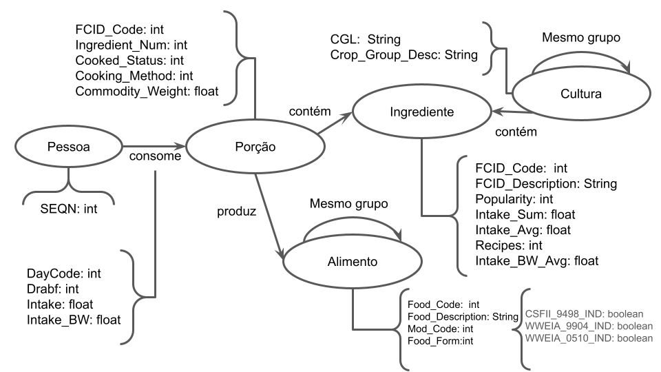

# Equipe Data Miners

# Subgrupo B
* Caio Melloni dos Santos - 167974
* Udson Charles Batagini - 244899
* Guilherme Segolin Selmi - 173947

## Modelo Lógico do Banco de Dados de Grafos

> 

## Perguntas de Pesquisa/Análise Combinadas e Respectivas Análises

> Dentro do grafo criado acima, é imediato que existem quatro possibilidades de nós para redes complexas: pessoa, porção, ingrediente e alimento. As arestas, entretanto, podem ser escolhidas em um grupo maior de possibilidades e, de certa forma, irão definir quais perguntas poderão ser respondidas pelo grafo. Feito essa ressalva, a seguir serão apresentadas perguntas mais gerais que as elaboradas pelo grupo no laboratório anterior, seguidamente do grafo mais apropriado para respondê-la e formas de encontrar a resposta partindo-se das técnicas introduzidas no terceiro vídeo.
* Dada uma nova receita quais são as pessoas com maior chance de consumiram o novo alimento baseado nas porções que consomem? (Link prediction) - 1
*  Encontrar refeições que possam substituir uma refeição dada (sem que um dos ingredientes esteja disponível mas mantendo ainda assim o maior número de alimentos possíveis). - 2
* Qual a distância média entre pessoas veganas e não veganas? E o grau de agrupamento desses grupos? Qual alimento está mais “próximo” das duas dietas - 3 (betweenness)
* Encontrar padrões relacionados ao consumo dos ingredientes. Consumidos no mesmo dia, consumo médio (consumo médio por peso corporal) parecido, que estão na mesma refeição. - 4 (IDEIA)
* Encontrar grupos de pessoas que consomem um intake_BW de porções semelhantes ou mesmo grupo de refeições que tenham alimentos semelhantes. - 5 (IDEIA)

## Transformações e técnicas
> 1 - Construir uma rede em que os nós indicam os ids dos indivíduos e as porções que consumiram. As arestas devem ligar pessoas que consumiram ao menos um alimento em comum. Será associado um peso a cada aresta, igual ao número de alimentos que os nós ligados consumiram em comum. Para responder a pergunta, crie um novo indivíduo fictício que consome as porções da nova refeição, ligue ele pela regra das arestas descrita acima. Veja os ligados a ele com seus respectivos pesos; atribua uma probabilidade maior para os nós ligados com maior peso.

> 2 - Construir uma rede em que os nós sejam as refeições com os respectivos ingredientes que fazem parte dela. As arestas devem ligar refeições com alimentos em comum. Será associado um peso para cada aresta, referente ao número de ingredientes que compartilham. Ao procurar por uma refeição sem um ingrediente específico, procurar primeiro pelos nós conectados com maior peso. Se não encontrar a refeição sem o ingrediente indesejado repetir o processo, agora procurando nos nós com o peso p-1 e (possivelmente podem ser nós ligados aos nós adjacentes procurados na etapa anterior). Repetir o processo até esgotarem as  possibilidades.

> 3 - Construir uma rede em que os nós indicam os ids dos indivíduos e se eles são veganos ou não. As arestas devem ligar pessoas que consumiram ao menos um alimento em comum. Podemos então medir a distância média de cada um dos veganos para um não vegano, e a média para todos os veganos dará a distância entre os grupos. Podemos comparar com a distância média intragrupo e verificar a mudança. Para o alimento mais “próximo” dos dois grupos criamos uma rede de ingredientes. As arestas ligarão ingredientes consumidos por mais de duas pessoas. Será calculado o número de caminhos mínimos que ligam um alimento consumido por um não vegano e um vegano. O alimento presente em mais caminhos será o mais próximo das duas dietas.
